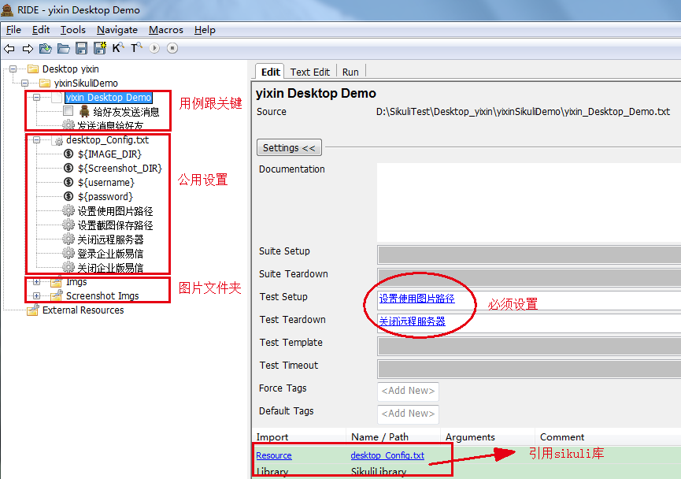

Sikuli Robot Framework Library
==============================

## 1.Introduction

Sikuli Robot Framework Library provide keywords to test UI through [Sikuli](http://www.sikuli.org/).

## 2.Overview

### 2.1 远程库技术原理(remoteLibrary Block)


### 2.2 整体架构图(architecture Block)


## 3.开发者文档

### 3.1 Build With Maven
```
mvn package
```
### 3.2 Upload python package to [pypi](https://pypi.python.org/pypi)
```
python setup.py register
python setup.py sdist upload
```

## 4.Installation
### 4.1 Pip installation

* Windows：
```
pip install robotframework-desktoplibrary
```
* Linux：
please download linux version from [pypi](https://pypi.python.org/pypi/robotframework-desktoplibrary)

## 5.远程部署
* 将C:\Python27\Lib\site-packages\SikuliLibrary\lib文件下的SikuliLibrary.jar放到远程机上
* 在远程机上启动测试库
```
java -jar SikuliLibrary.jar  <port>
```
* 在本机启动远程服务器，调用远程机测试库
```
Library        Remote        http://<ip>:<port>/
```

## 6.Keyword Documentation

- [x] [DesktopLibrary](http://10.240.129.121/rfui/DesktopLibrary_Keywords.html)    Detail Keywords Documentation


## 7.Attention

* 开始测试时，一定要让目标对象出现在当前屏幕，不要被挡到奥~:blush:

* `Desktop Set Image Path`   必须设置，从这个文件夹下寻找图片，建议填写在setup中；Stop Remote Server 必须设置，测试完要关闭，建议填写在teardown中

* `Desktop Click，Desktop Double Click，Desktop Right Click`，此类关键字的arguments可选，可以选择填写一张图片或者两张图片。这是为了解决当前屏幕存在多张相同图片时sikuli无法识别的问题。当有两张图片时，建议图片命名格式为：`test.png,test_area.png`

* 所有操作的对象都是图片，所以图片命名一定要具有可读性

## 8.Example
### 8.1 yixin_Desktop_Demo

